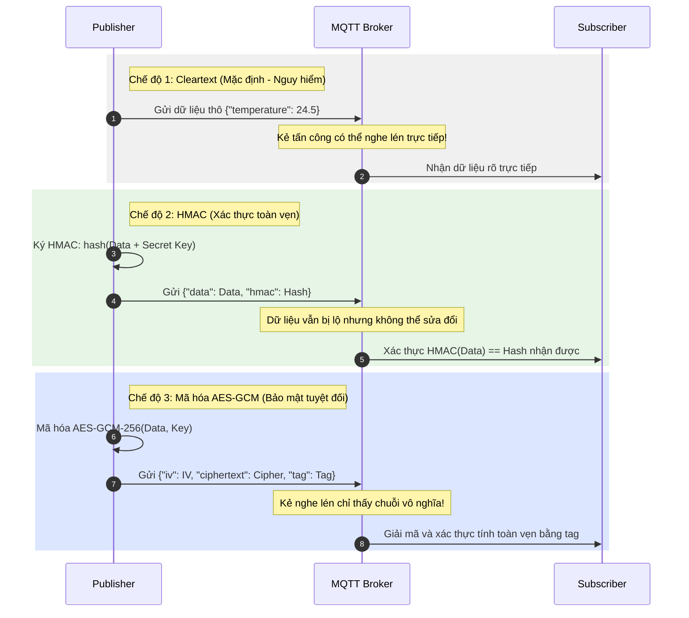

# Đề tài 27: Nghe lén dữ liệu cảm biến trong mạng IoT

Repository chính thức cho tiểu luận môn **Bảo mật IoT** - Trường Đại học Văn Hiến (VHU).

* **Sinh viên thực hiện:** Thi Võ Hoàng Huy
* **Mã số sinh viên:** 231A010454
* **Đề tài số:** 27
* **Tên đề tài:** Nghe lén dữ liệu cảm biến trong mạng IoT

---

## 1. Cấu trúc Repository
Repository được tổ chức theo cấu trúc bắt buộc như sau:

```text
De_tai_27-Nghe_len_du_lieu_trong_mang_IoT/
├── README.md                 # Hướng dẫn chi tiết dự án (Tệp tin này)
├── report/                   # Thư mục chứa báo cáo tiểu luận (.docx hoặc .pdf)
├── slides/                   # Thư mục chứa slide trình bày (.pptx hoặc .pdf)
├── src/                      # Mã nguồn Python demo
│   ├── publisher.py          # Publisher giả lập thiết bị cảm biến gửi dữ liệu
│   ├── subscriber.py         # Subscriber đóng vai trò Server nhận và kiểm tra dữ liệu
│   └── utils.py              # Hàm bổ trợ bảo mật (AES-256-GCM và HMAC-SHA256)
├── configs/                  # Tệp tin cấu hình hệ thống
│   ├── mosquitto.conf        # Cấu hình bảo mật MQTT Broker Mosquitto
│   ├── aclfile               # Danh sách kiểm soát quyền truy cập của người dùng
│   └── passwd                # Tệp băm mật khẩu người dùng
├── data/                     # Dữ liệu mô phỏng cảm biến
│   ├── dataset_gia_lap.csv   # Dữ liệu giả lập nhiệt độ và độ ẩm
│   └── payload_mau.json      # Bản tin JSON mẫu trước và sau khi bảo vệ
├── results/                  # Kết quả thực nghiệm
│   ├── screenshots/          # Hình ảnh chạy demo chương trình
│   ├── logs/                 # Nhật ký giao thức thu giữ được trên đường truyền
│   └── output.csv            # Dữ liệu lưu trữ thực tế tại subscriber
└── references/               # Tài liệu tham khảo
    └── link_nguon.md         # Danh sách liên kết mã nguồn và tài liệu
```

---

## 2. Mô hình đe dọa và Bảng đánh giá rủi ro
Khi dữ liệu cảm biến truyền tải thô (Cleartext) qua MQTT, kẻ tấn công trên cùng đường truyền mạng có thể dễ dàng nghe lén (Eavesdropping), sửa đổi gói tin (Tampering) hoặc giả mạo thiết bị (Spoofing).

| Rủi ro / Mối đe dọa | Mô tả chi tiết | Hậu quả | Biện pháp giảm thiểu |
| :--- | :--- | :--- | :--- |
| **Nghe lén dữ liệu (Eavesdropping)** | Kẻ tấn công sniff gói tin qua Wi-Fi công cộng hoặc LAN để đọc trộm dữ liệu JSON dạng thô. | Rò rỉ thông tin riêng tư, lộ tình trạng thiết bị nhạy cảm. | Sử dụng truyền thông mã hóa TLS hoặc mã hóa trực tiếp Payload (**AES-GCM-256**). |
| **Sửa đổi dữ liệu (Tampering)** | Kẻ tấn công sửa đổi giá trị cảm biến khi đang truyền đi (ví dụ: đổi nhiệt độ từ 25°C thành 99°C). | Gây sai lệch trạng thái hệ thống điều khiển, báo động giả. | Sử dụng mã xác thực thông điệp có khóa **HMAC-SHA256** hoặc mã xác thực tích hợp trong **AES-GCM**. |
| **Giả mạo thiết bị (Spoofing)** | Thiết bị không có định danh an toàn, kẻ xấu có thể gửi bản tin giả danh `device_id` của nhóm. | Gây ngập lụt hệ thống, lưu trữ dữ liệu giả tạo. | Cấu hình bắt buộc xác thực Username/Password trên Broker, cấp quyền cụ thể bằng **ACL**. |

---

## 3. Sơ đồ luồng bảo vệ dữ liệu (Mermaid)

Sơ đồ dưới đây minh họa sự khác biệt giữa 3 chế độ truyền dữ liệu: `cleartext` (không bảo vệ), `hmac` (chống sửa đổi) và `encrypted` (chống nghe lén + chống sửa đổi).



---

## 4. Hướng dẫn cài đặt và Chạy thực nghiệm

### Bước 1: Chuẩn bị môi trường
Yêu cầu hệ thống đã cài đặt **Python 3.x**. Cài đặt các thư viện cần thiết bằng lệnh:

```bash
pip install paho-mqtt cryptography
```

### Bước 2: Chạy Demo

Chúng ta sử dụng Broker công cộng miễn phí `test.mosquitto.org` (mặc định) để mô phỏng mà không cần cài đặt Mosquitto cục bộ. Để chạy demo, hãy mở **2 cửa sổ Terminal** riêng biệt:

#### Kịch bản 1: Truyền dữ liệu thô (Cleartext) - Dễ bị nghe lén
1. Khởi động **Subscriber** lắng nghe ở chế độ dữ liệu rõ:
   ```bash
   python src/subscriber.py --mode cleartext
   ```
2. Khởi động **Publisher** gửi dữ liệu cảm biến:
   ```bash
   python src/publisher.py --mode cleartext --interval 1.5
   ```
* **Kết quả quan sát:** Subscriber hiển thị trực tiếp JSON thô. Bất cứ ai nghe lén gói tin MQTT trên topic này đều đọc được toàn bộ nhiệt độ, độ ẩm của thiết bị.

#### Kịch bản 2: Bảo vệ tính toàn vẹn (HMAC) - Phát hiện sửa đổi gói tin
1. Khởi động **Subscriber** lắng nghe:
   ```bash
   python src/subscriber.py --mode hmac
   ```
2. Khởi động **Publisher** gửi dữ liệu có kèm chữ ký HMAC:
   ```bash
   python src/publisher.py --mode hmac --interval 1.5
   ```
3. **Giả lập tấn công sửa đổi gói tin:** Giữ nguyên Publisher đang chạy bình thường, chạy Subscriber ở chế độ giả lập bị tấn công:
   ```bash
   python src/subscriber.py --mode hmac --simulate-attack
   ```
* **Kết quả quan sát:** Khi bật `--simulate-attack`, subscriber nhận thấy dữ liệu bị thay đổi, chữ ký HMAC tính toán lại không khớp với HMAC đính kèm, lập tức thông báo lỗi `XÁC THỰC HMAC THẤT BẠI: Phát hiện dữ liệu đã bị sửa đổi trái phép!`.

#### Kịch bản 3: Mã hóa dữ liệu (AES-256-GCM) - Bảo mật tuyệt đối
1. Khởi động **Subscriber** lắng nghe:
   ```bash
   python src/subscriber.py --mode encrypted
   ```
2. Khởi động **Publisher** gửi dữ liệu đã mã hóa:
   ```bash
   python src/publisher.py --mode encrypted --interval 1.5
   ```
3. **Giả lập tấn công phá hoại ciphertext:** Chạy Subscriber với cờ giả lập tấn công sửa đổi bản mã:
   ```bash
   python src/subscriber.py --mode encrypted --simulate-attack
   ```
* **Kết quả quan sát:**
  - Ở trạng thái bình thường, dữ liệu gửi đi trên đường truyền chỉ là một chuỗi Base64 vô nghĩa, đảm bảo tuyệt đối tính bí mật. Subscriber giải mã thành công nhờ sở hữu khóa đối xứng.
  - Khi bật `--simulate-attack`, subscriber thực hiện giải mã và nhận thấy mã xác thực dữ liệu (Authentication Tag) không khớp, lập tức thông báo lỗi `LỖI GIẢI MÃ: Kẻ tấn công đã sửa đổi gói tin hoặc khóa không đúng!`.

---

## 5. Cấu hình MQTT Broker Mosquitto nội bộ (Nâng cao)
Để triển khai thực tế trên máy cục bộ thay vì dùng broker công cộng:
1. Cài đặt Mosquitto Broker lên máy tính của bạn.
2. Di chuyển tệp tin `configs/mosquitto.conf`, `configs/aclfile` và `configs/passwd` vào thư mục cài đặt hoặc chạy Mosquitto trỏ tới tệp cấu hình:
   ```bash
   mosquitto -c configs/mosquitto.conf -v
   ```
3. Thêm các tham số xác thực tài khoản khi chạy mã nguồn demo:
   ```bash
   python src/subscriber.py --broker localhost --mode cleartext --username subscriber_user --password sub_password_456
   python src/publisher.py --broker localhost --mode cleartext --username publisher_user --password pub_password_123
   ```
